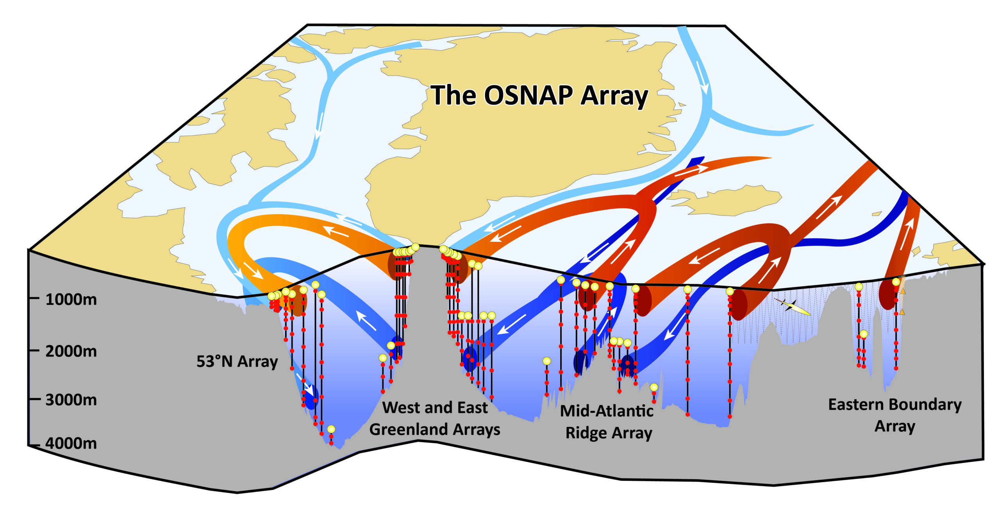
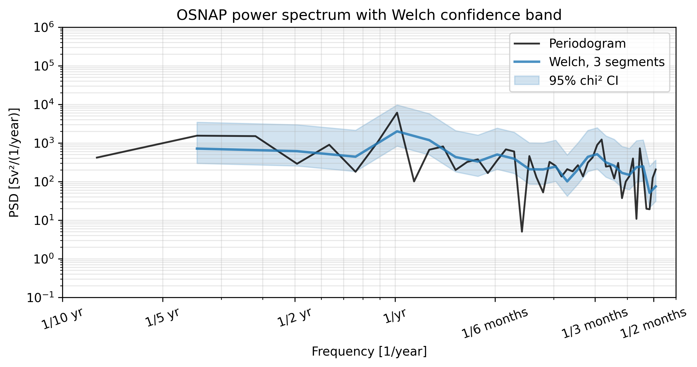
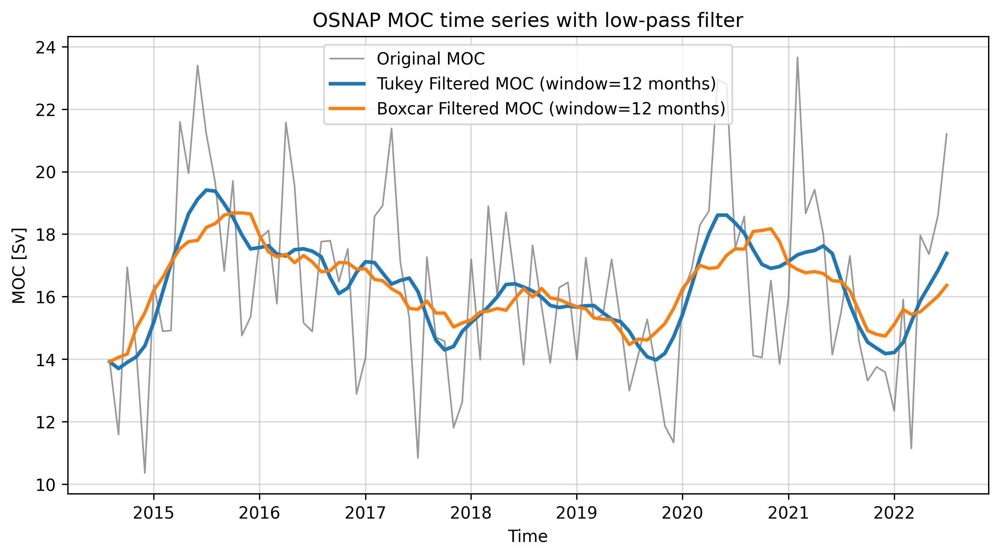
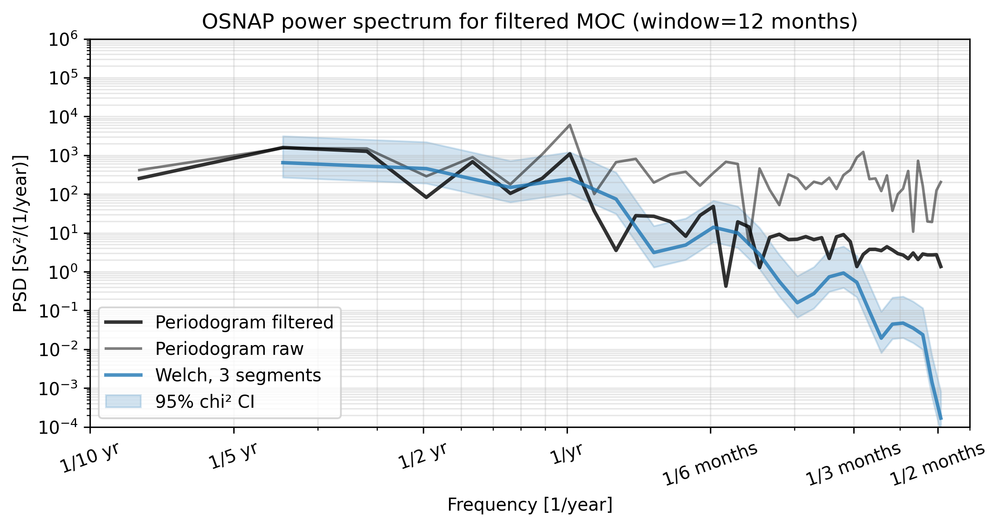

# **OSNAP EAST - CHARACTERIZATION AND SPECTRAL ANALYSIS**

# Table of contents
1. [Introduction](#introduction)
2. [Characterize the data in time domain](#characterize-the-data-time-domain)
    - [Introduction to the time series](#introduction-to-the-time-series)
    - [Properties of the time series](#properties-of-the-time-series)
3. [The Spectrum](#the-spectrum-frequency-domain)
    - [Welch's power spectrum](#welchs-power-spectrum)
        - [Dominant Timescales](#dominant-timescales)
        - [Parseval Ratio](#parseval-ratio)
4. [Apply a filter](#apply-a-filter)
    - [Filter design](#filter-design)
    - [Comparison to boxcar](#comparison-to-boxcar)
    - [Welch's spectrum with filtered times series](#welch-spectrum-with-filtered-time-series)
5. [Conclusion](#conclusion)
6. [Sources](#sources)

# Introduction
This report aims to characterize the meridional overturning at the OSNAP East location between Greenland and Scotland. The dataset was loaded using the AMOCatlas package and includes both, measurements at the OSNAP East and West location and their respective components like meridional heat- and freshwater transport as well as a variable denoting the maximum of the overturnng streamfunction in sigma_theta coordinates for both location and for the total overturning. The latter (MOC_EAST_SIGMA0) is the variable which will be analyzed in this assignment. Zero denotes the reference level used for the calculation. 

# Characterize the data (time domain)

## Introduction to the time series 
OSNAP (Overturning in the subpolar North Atlantic) is an observational program which provides information about transport and hydrographic estimates between 2014 and 2022 for the overturning in the subpolar North Atlantic.

## Properties of the time series 
The timeseries of the MOC at OSNAP East begins 2014-08-01 at 12pm and ends in 2022-07-01 also at 12pm, which results in a record length of 7 years and 11 months. We have a monthly resolution, which can be seen when comparing consecutive timesteps, meaning we have 96 individual data points. The sample is always given at the first day of the month at 12pm. 

The timeseries has no missing values, which was determined by summing all NaNs present and printing them (0) and also searching for values which are extremely large (0), which is sometimes used as a filler for missing values. Therefore, no gap-handling method was needed or applied. As linear interpolation was used when handling the input data for this transport estimate, it would probably also be the natural choice if this dataset would have had gaps. 

The MOC timeseries is centered around a mean strength of 16.4 Sv with a standard deviation of 2.9 Sv. The amplitude ranges from 10.4 Sv as a minimum strength which was observed in December of 2014, up to 23.7 Sv, which was seen in February of 2021.

*Figure 1: Histrogram of MOC OSNAP-East*

In figure 1, we see the histrogram of the amplitude distribution of the MOC strength. Surprisingly it is relatively normally distributed, although we only have monthly values for a ~8 year record. The most values lie in the 14 Sv bin, which is probably why the mean is around 16 Sv, although we have so many higher values as well. Interestingly, there are no measurements which fall into the 20 or 22 Sv bin, which makes the histogram appear discontinued. 

# The spectrum (frequency domain) 

## Welch's power spectrum
Here, we translate our timeseries into frequency space to determine spectral properties. What is important for this analysis is a continuos time axis, so if there would have been any gaps in the dataset, an interpolation would be necessary.

After that, the periodogram can be calculated. The default window chosen for this is boxcar. Other windows would be a better choice to prevents leakage as we would then have less sidelobes and a more tapered distribution. The boxcar window is great for time domain, and hann is good for frequency domain. Tukey is kind of middle of the road, so okay in both, time- and frequency domain. 

The next thing that is important is to define the segment length. As previously stated we have 96 individual data points. As the record is limited to 8 years, we cannot have very many segments, or we will lose a lot of information in the lower frequencies. Here I chose th segment length to be 48 data points. WIth a segment overlap of 50% this results in 3 segments total and therefore 6 degrees of freedom.

After defining those parameters we can calculate the Welch's spectrum, which divides your timeseries into different segments, which in this case overlap by 50%, average each segment and provide an averaged and advanced version of your periodogram, For Welch's spectrum we use a hann-filter as, due to its definition, it conserves spectral properties the best. 

*Figure 2: Periodogram of the original MOC_EAST_SIGMA0 timeseries (black), Welch spectrum for 3 segments with a length of 48 datapoints and 50% overlap (blue) and Chi² confidence intrval (blue shading).*

Figure 2 illustrates the difference betweent the raw periodogram, calculated from the original data and the overlayed Welch's spectrum. THe Welch spectrum looks smoother, because we divide our timeseries into segments and average, to make dominant timescales better visible.

### Dominant timescales
Here, the dominant timescales fall into the frequency of 1/year which highlights a strong annual cycle. In addition to that there is also a peak visible at a freqency of 1/3 months.
There is no rolloff seen in this periodogram, probably because we do not have any signals which are more frequent than on monthly timescales. 

### Parseval ratio
The parseval ratio is a good way to determine if your spectral analysis shows the same as the time analysis. Here we compare the variance of our parameter x. In the time domain we take the variance using numpy (np.var(x)) and in frequency domain we sum our power spectral density and multiply by our timestep length. If both of these parameters are equal we are doing a good job. Therefore we look at the ratio of both, which should be 1. Here our variance in the time domain is 8.364, in the periodogram it is 8.339  and in welch it is 7.082, which gives a parseval ratio of 0.993 if we consider time domain and periodogram. If we compare our time domain to our Welch spectrum we get 0.847, whcih makes sense, because due to the averaging some of the spectral properties may have been lost, resulting in a lower ratio. 

### Chi-squared confidence interval and degrees of freedom 
In order to be more confident in our visualized periodogram/ Welch spectrum we can also calculate the chi² confidence interval. This confidence interval is determined by our degrees of freedom, which are twice our number of averaged segments. For our analysis this means we have 3 segments, 2 completely independent ones and one which overlaps 50% with each of them, which we still consider individual, resulting in a total of 6 degrees of freedom. (dof = 2 * number_of_segments) We can then calculate the 95% confidence interval, which is shown in e.g. Fig. 2. 

# Apply a filter 
Now as previously mentioned the timeseries is already in a monthly resolution with a possible 3 month tukey-filter applied. (Unfortunately I could not find any record on this, but if I apply a 3 month tukey-filter to the original dataset, the timeseries stays exactly the same. A 3 month boxcar-filter changes the timeseries).

## Filter design 
I chose a 12 month filter to visualize the annual cycle and filter out any seasonal changes we might have. If I widen the window to 18 months, much of the annual cycle is filtered out. As the timeseries is only ~8 years long, applying a filter with a large window might not show any of the important signals anymore. 5 yearly or decadal variability is not really possible to analyse with this dataset yet. Therefore 12 months is a great choice as you filter out the high frequency variability on shorter timescales and the seasonal cycle, but still see much of the annual patterns and soome decadal trends. 
 

*Figure 3: Original MOC_EAST_SIGMA0 timeseries (grey), 12 month tukey-filtered timeseries (blue), 12 month boxcar filtered timeseries (orange).*

## Comparison to boxcar
I specifically chose the 12 month window to be able to see the dominant timescale of 1 year. This is greatly represented when I filtered the timeseries with the tukey filter, seen in blue. The peaks and troughs seen in the original data are still present in the tukey-filtered timeseries. 
If we now compare this to a boxcar filter of the same length applied to the same dataset, seen in orange, we observe stark differences in how the annual varaibility is represented. The peaks and troughs, shown in the tukey-filtered timeseries are not visible anymore in the boxar timeseries. In addition to that the tukey-timeseries is able to capture changes on smaller timescales as well. For example in the beginning of 2020 and 2021 the MOC seems to spike in strength, whereas between those spikes it's strength returns back closer to the mean strength. The tukey-filtered timeseries shows this change best: it shows both peaks and the return to the weaker state, whereas the boxcar filter shows the maximum to be at exactly at the time where the MOC was actually at the mean strength and does not capture the two strong events at all. 
Furthermore, the tukey-filtered timeseries looks smoother in general, which makes a visual analysis easier than for the boxcar-filtered timeseries. 

## Welch spectrum with filtered time series
As previously stated the original timeseries has no rolloff period. But if I apply a 12 month filter, the rolloff is visible. 

*Figure 4: Periodogram of the original timeseries (grey), peridogram of the 12 month tukey-filtered timeseries (black), Welch spectrum for segment length of 48 datapoints so 3 segments in total with 50% overlap(blue), Chi² confidence interval for Welch spectrum (blue shading).*

You can see that the Welch spectrum now deviates from both the periodogram of the filtered MOC and the original periodgram, which is what we expect for filtered timeseries. 
This figure also highlights the differences in periodograms for filtered and unfiltered datasets. All three lines still show the peak at a frequency of a year, but only the original periodogram highlights the 3 month timescale. This means we successfully filtered out seasonality from our timeseries by applying the 12 month tukey-filter. 

# Conclusion
All in all we can conclude that the MOC at OSNAP EAST has a mean strength of 16.4 +- 2.9 Sv in the 7 years and 11 month of data available from August of 2014 to July of 2022. If we perform a spectral analysis the dominant timescales we find are located around 1 year and at 3 months, which hints at a strong yearly signal. Filtering our timeseries with the right filter also highlights those yearly variations and successfully surpresses seasonality. The results were validated using the Parseval ratio and coding tests. 

# Sources
- Emery & Thomson, Data Analysis Methods in Physical Oceanography, Ch. 5 (§5.6 Spectral
analysis; §5.10 Digital filters)
- AMOCatlas: https://github.com/AMOCcommunity/AMOCatlas 
- Lecture deck and starter code (code/spectra_filtering, code/make_figures.py)
- Li, F., M.S. Lozier, S. Bacon, A. Bower, S.A. Cunningham, et al. (2021): Subpolar North Atlantic western boundary density anomalies and the Meridional Overturning Circulation, Nature Communications, 12(1). doi: 10.1038/s41467-021-23350-2