# **Geostrophic transport and relating AMOC series**

https://github.com/isaschmitz/data_analysis-assignment

# Table of contents
1. [Introduction](#introduction)
2. [Data](#data)
3. [Geostrophic transport](#geostrophic-transport)
    - [Calculate interior transport](#calculate-interior-transport)
    - [Compare to RAPID UMO](#compare-to-rapid-umo)
4. [Evaluating time series](#evaluating-time-series)
    - [Single series](#single-series)
        - [Deseasonalize](#deseasonalize)
        - [Autocorrelation](#autocorrelation)
        - [Linear trend assessment](#linear-trend-assessment)
    - [A pair of series](#a-pair-of-series)
        - [Pre-filtering](#pre-filtering)
        - [Cross-correlation](#cross-correlation)
        - [Interpretation](#interpretation)
5. [OSNAP full vs OSNAP West vs OSNAP East](#osnap-full-vs-osnap-west-vs-osnap-east)
6. [Conclusion](#conclusion)
7. [Sources](#sources)

<!-- 

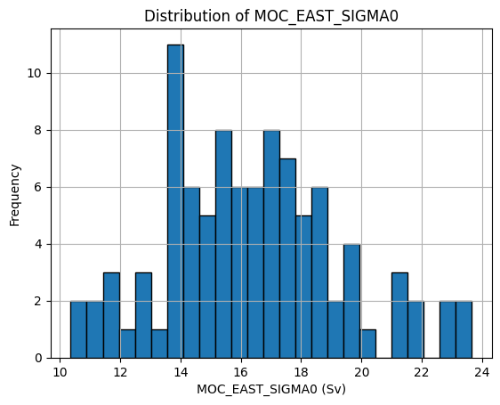

*Figure 1: Histrogram of MOC OSNAP-East*

 -->

# Introduction

The AMOC, a complex system of ocean currents, has been continuously measured by the RAPID array at 26°N array for over 20 years.

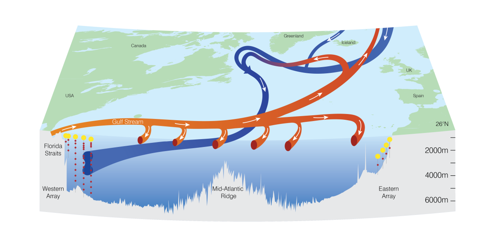

*Figure 1: Illustration of the AMOC and the RAPID array at 26°N*

In this report I will first calculate the interior, geostrophic component of the upper-mid-ocean transport from temperature and salinity profiles at the eastern and western boundaries and compare it with the published RAPID-UMO transport. I then evaluate the RAPID MOC and UMO timeseries in more depth, focusing on their persistence, the integral timescales, and the effective degrees of freedom this implies at different processing stages. After that I assess the significance of a linear trend in both timeseries, interpreting the uncertainty in respect to the effective sample size.

To understand how the 26°N array is connected with the subpolar North Atlantic, I then compare the RAPID MOC with the OSNAP MOC and look for a lead/lag relationship via cross-correlation, after bringing both timeseries onto a comparable resolution. I will conclude this by decomposing the full OSNAP MOC into its eastern and western components and comparing each with the RAPID timeseries, to see whether a clearer linkage can be seen.

Finally, I will summarize and discuss the results with a focus on uncertainty ranges and physical connectivity.

# Data

All data used in this report is downloaded via the `amocatlas` package. This includes the RAPID 26°N transport dataset, which provides a 22-year record (2004-04-02 to 2024-03-27) of all transport components at 12-hourly resolution, resulting in 14,599 data points and the 2D-gridded data product, providing temperature and salinity profiles over time for the west, east, and additional single-mooring locations on a 20 dbar pressure grid (242 depth levels) over the same time period as the transport timeseries. Additionally, I used the OSNAP dataset, spanning 2014-08-01 to 2022-07-01, which results in about 7 years and 11 months of data with 96 individual datapoints as this timeseries only provides monthly resolution. The same applies to the individual components of the OSNAP MOC, OSNAP West and OSNAP East.

# Geostrophic transport

T_MOC is defined as the sum of T_FC, the Florida Current component which accounts for the Gulf Stream, T_Ek, the Ekman transport, and T_UMO, the upper-mid-ocean transport:

$$T_{MOC} = T_{FC} + T_{Ek} + T_{UMO}$$

T_UMO can again be decomposed into the interior transport (the geostrophic component), the western boundary wedge, and the exterior transport, a compensation term that ensures no meridional net flux across the array:

$$T_{UMO} = T_{int} + T_{wbw} + T_{ext}$$

More generally, the AMOC is defined as the maximum of the transport stream function after combining all components: Florida Strait, Ekman, interior, western boundary wedge, and exterior:

$$\text{AMOC}(t) = \Psi(t, z_{max}), \qquad \Psi(t,z) = \int^{z} \left\{ T_{FC} + T_{Ek} + T_{wbw} + T_{int} + T_{ext} \right\}(t,z')\, dz'$$

In this report the focus is on the interior transport (T_int), as this geostrophic component explains most of the variability and amplitude of the upper-mid-ocean transport. Based on the thermal wind equation, which relies on zonal pressure gradients, T_int can be estimated from the difference in dynamic height between the western and eastern boundary of the RAPID array at 26°N, scaled by the Coriolis parameter and integrated over depth to the depth of the AMOC maximum at around 1100 dbar.

This depth criterion applies when northward-flowing AAIW is present. Without a northward AAIW flow, the AMOC depth instead corresponds to the depth of the Florida Straits (700 m). Under the 1100 m criterion, the strength of the AMOC is defined as the sum of the Florida Strait and Ekman components plus the upper-mid-ocean transport which corresponds to the mid-ocean transport integrated from the surface to the AMOC maximum. This depth is not only where the AMOC has its maximum strength, but also close to the interface between northward-flowing AAIW and southward-flowing upper NADW. Since the AMOC value is obtained by summing the flow above the 1100 dbar interface, the upper-mid-ocean transport is constrained to the same depth (McCarthy et al., 2015).

## Calculate interior transport

To estimate the interior transport I use the gridded `ts` dataset. Dynamic height is derived using functions provided by the GSW toolbox, following the TEOS-10 standard. T_int is then calculated using the provided functions, found in `geostrophy.py`, which are based on the methods of McCarthy et al., (2015).

## Compare to RAPID UMO

T_int captures most of the variability and amplitude of the UMO transport (Fig. 2). The remaining difference comes from the two additional components (the western boundary wedge and the exterior term) which are included in the RAPID UMO product but not in the calculated interior component. Additionally, differences arise due to the simplified calculations here. Where McCarthy et al., (2015) uses a time-varying AMOC-maximum depth, I set a constant value of 1100m, and the mass-balance adjustment they apply is not accounted for here. 

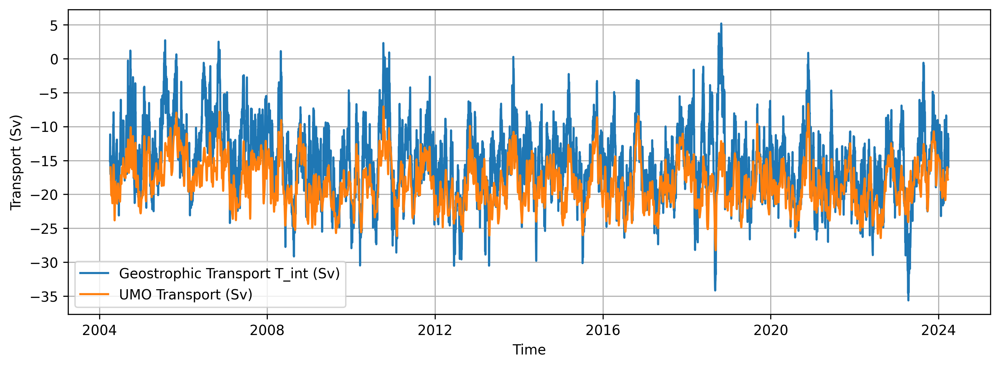

*Figure 2: T_int vs UMO*

The mean value of the interior transport is slightly weaker (−15.24 Sv) than the actual UMO transport (−18.37 Sv). Additionally, the interior transport has an amplitude range of over 40 Sv, whereas the UMO transport's amplitude range is around 21.6 Sv. This implies that the western boundary wedge and exterior component together with the additional analysis steps missing here, must result in a more southward-intensified flow with a damped amplitude range.

a
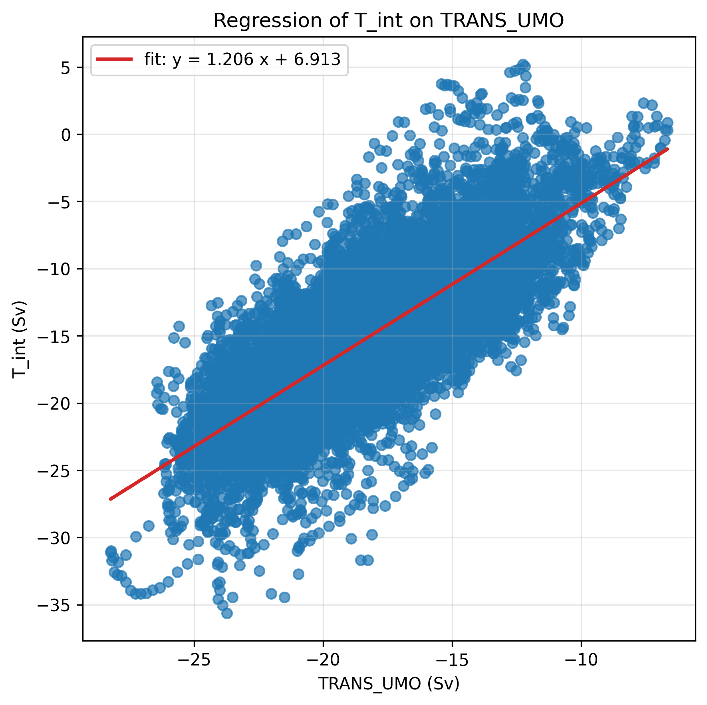

*Figure 3: Regression of T_int on TRANS_UMO*

A regression analysis between T_int and TRANS_UMO gives a fit of y = 1.206x + 6.913. A slope greater than one confirms that the amplitude of the variability is higher in Tint in comparison to what is captured by UMO.

# Evaluating time series

## Single series

### Deseasonalize

The long-term signal of a timeseries can often be dominated by seasonal fluctuations, which hide the real interannual variability and trend. To ensure the following analysis focuses on the interannual signal rather than the seasonal fingerprint, the data is deseasonalized. The monthly climatology is calculated and subtracted from the timeseries, and the overall mean is added back so the deseasonalized series still represents the real physical values:

$$x'(t) = x(t) - \bar{x}_{\text{month}}(t) + \bar{x}$$

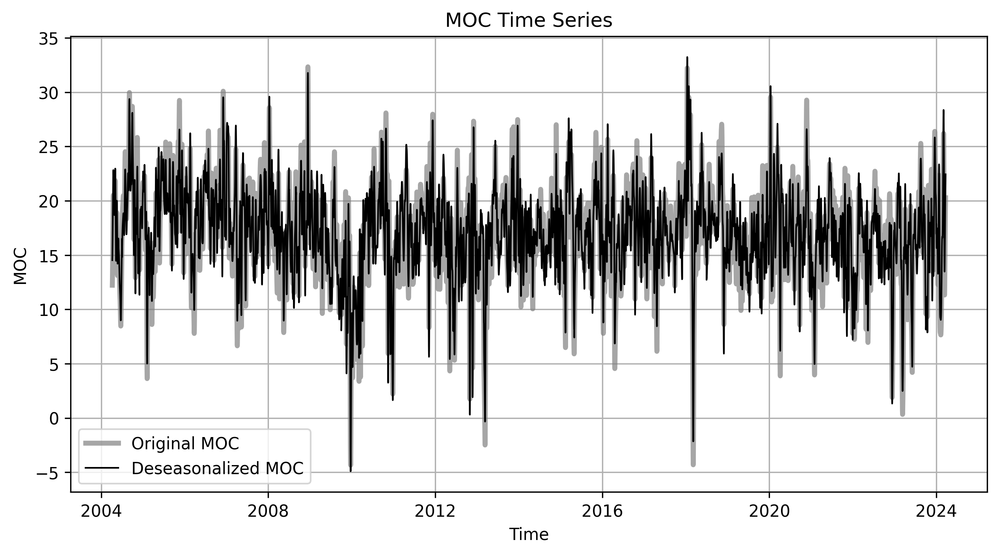

*Figure 4: RAPID MOC raw and deseasonalized*

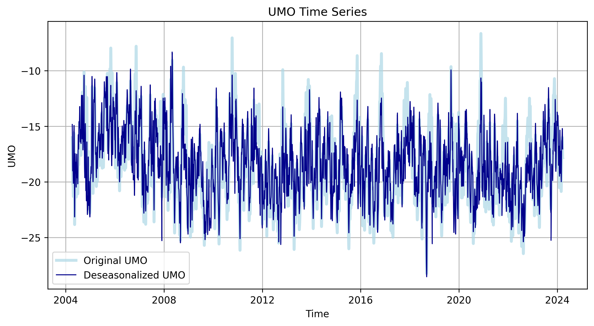

*Figure 5: RAPID UMO raw and deseasonalized*

### Autocorrelation

The memory of the ocean can be quantified by autocorrelation: the persistence of the timeseries, or how fast the property "forgets itself". To calculate the autocorrelation, the timeseries is shifted forward by one timestep and then correlated with the original, unshifted timeseries. The time at which the correlation first drops below zero is called the first zero-crossing ($\tau_{0}$), and can be used to estimate the decorrelation timescale which corresponds to the integral, between zero and the first zero-crossing, of the autocorrelation function, known as the integral timescale:

$$T^{*} = \int_{0}^{\tau_{0}} R(\tau)\, d\tau$$

This timescale measures how fast the timeseries forgets itself. After this time we can expect independent datapoints again, since all datapoints within the decorrelation timescale could still be influenced by the original state of the timeseries. This lets us estimate the effective degrees of freedom (EDOF), also called the effective sample size, so how many independent samples we actually have:

$$\text{EDOF} = \frac{N}{2T^{*}}$$

For example, if a timeseries is 10 days long and sampled once a day, but the decorrelation time is 2 days, we do not actually have 10 independent samples, but only 5, since half of them are still influenced by the previous value.

| Series (12-hourly, detrended) | Integral timescale | EDOF (N_eff) |
|---|---|---|
| MOC | 18.51 days | 196.89 |
| UMO | 22.52 days | 161.88 |

This table shows both the integral timescale and the effective degrees of freedom for the RAPID MOC and UMO. With 18.5 days the MOC's persistence is shorter by around 4 days than it is for the UMO. This means the upper-mid-ocean component holds information on slightly longer timescales as the MOC. 

### Linear trend assessment

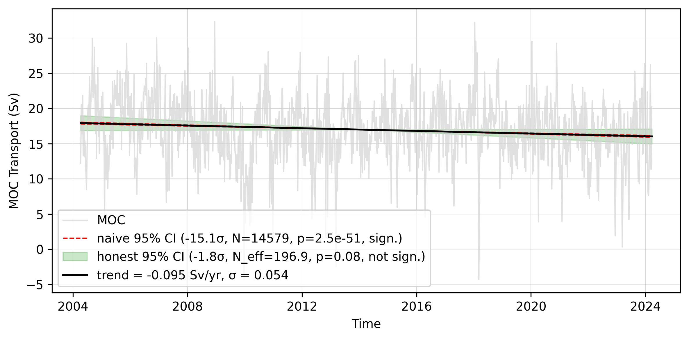

*Figure 6: RAPID MOC trend with uncertainty*

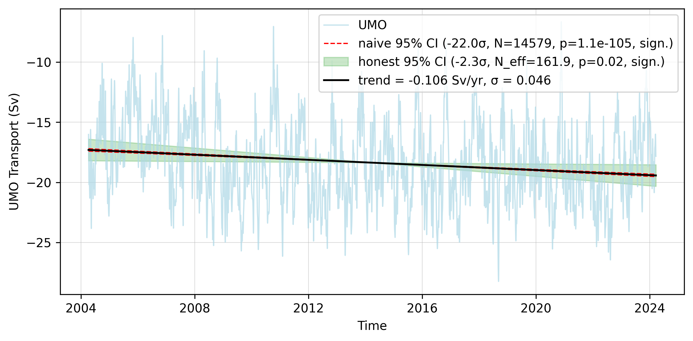

*Figure 7: RAPID UMO trend with uncertainty*

- **MOC:** trend = −0.095 Sv/yr (σ = 0.054). Naive test (N = 14,579): −15.1σ, p = 2.5×10⁻⁵¹. Honest test using EDOF (N_eff = 196.9): −1.8σ, p = 0.08 → **not significant** at 95%.
- **UMO:** trend = −0.106 Sv/yr (σ = 0.046). Naive test (N = 14,579): −22.0σ, p = 1.1×10⁻¹⁰⁵. Honest test using EDOF (N_eff = 161.9): −2.3σ, p = 0.02 → **significant** at 95%.

In both cases the naive p-value overestimates confidence by many tens of orders of magnitude relative to the honest estimate using the EDOF. This direct consequence of treating 12-hourly samples as independent when the decorrelation timescale is weeks, not hours shows how simple it is to misinterpret a bigger sample size for higher significance.

## A pair of series

Now we translate the analysis into the comparison of different timeseries. For this I chose to evaluate the connection between the RAPID 26°N MOC and the OSNAP MOC.

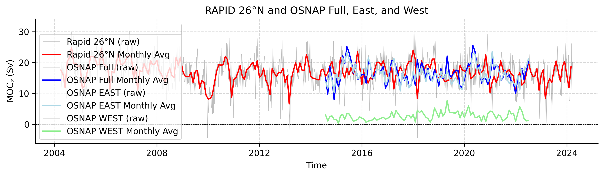

*Figure 8: RAPID and OSNAP MOC*

### Pre-filtering

As the OSNAP data is on a monthly time grid, but RAPID provides 12-hourly data, the RAPID MOC must be subsampled to match the OSNAP data product. First, the actual time resolution of the OSNAP product is determined (1 month), with each value assigned to the first day of the month at 12:00. The RAPID data is then resampled by taking monthly means and assigning them to the same timestep as OSNAP for consistency. As RAPID provides a 12-year longer record, the timeseries is also cut to the same length as the OSNAP data, which is necessary for the calculations that follow.

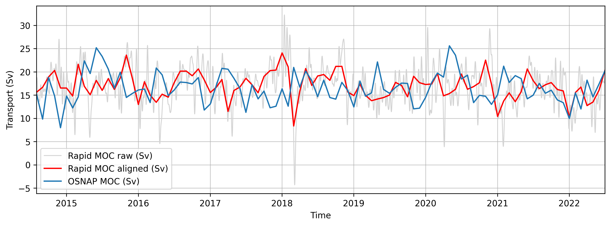

*Figure 9: RAPID vs OSNAP MOC, matched resolution*

### Cross-correlation

Cross-correlation is essentially the same operation as the autocorrelation above, except the shifted timeseries is not compared to its own past state but to a second, independent timeseries.

<!-- $$C_{xy}(\tau) = \frac{\sum_t (x(t)-\bar{x})(y(t+\tau)-\bar{y})}{\sqrt{\sum_t (x(t)-\bar{x})^2}\sqrt{\sum_t (y(t+\tau)-\bar{y})^2}}$$ -->

One timeseries is held fixed while the other is shifted in time. The correlation is then calculated at each lag, and the lag of maximum correlation is identified. If timeseries 1 is held constant and timeseries 2 is shifted forward in time, a positive lag at the maximum means timeseries 2 leads timeseries 1 by that time period. This lets us identify connections, coherence, and characteristic timescales between two records although, as always, correlation does not by itself imply causality.

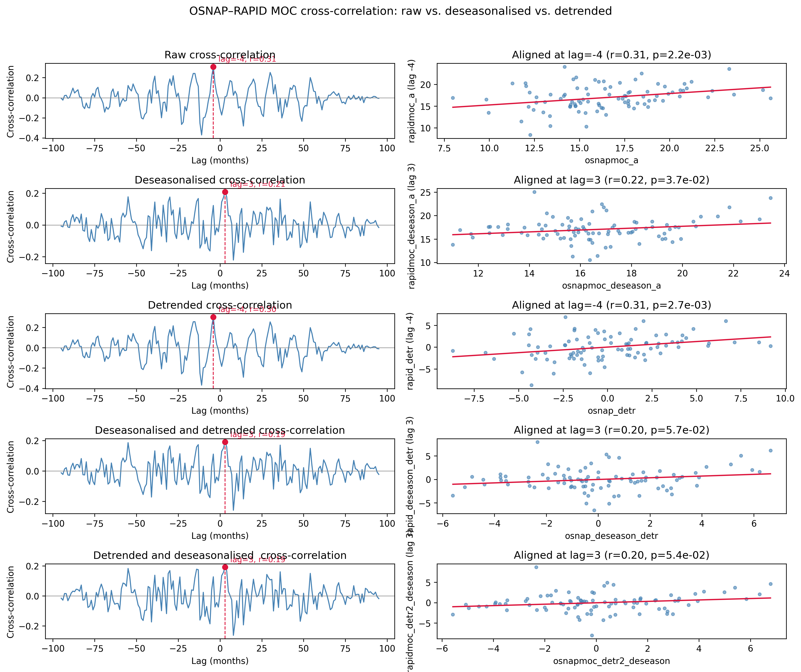

*Figure 10: Cross-correlation between RAPID and OSNAP at multiple processing stages*

### Interpretation

Persistence, and with it the effective sample size, changes with each processing step. The table below reports the integral timescale and EDOF for OSNAP and RAPID MOC (monthly, aligned) at each stage:

| Series | Processing | Integral timescale (months) | EDOF (N_eff) |
|---|---|---|---|
| OSNAP MOC | raw | 0.53 | 45.62 |
| OSNAP MOC | deseasonalised | 0.48 | 50.07 |
| OSNAP MOC | detrended | 0.52 | 46.02 |
| OSNAP MOC | deseasonalised + detrended | 0.46 | 51.98 |
| RAPID MOC | raw | 0.36 | 66.76 |
| RAPID MOC | deseasonalised | 0.30 | 80.47 |
| RAPID MOC | detrended | 0.33 | 72.13 |
| RAPID MOC | deseasonalised + detrended | 0.27 | 88.52 |

Both series become slightly less persistent (shorter integral timescale, higher EDOF) once the seasonal cycle and trend are removed, since these are the two sources of low-frequency structure that overestimate shorter-lag autocorrelation. Even when both are deseasonalized and detrended, the two series still only offer on the order of 50–90 independent samples out of the 96 monthly points available. This is smaller than the raw sample size, and the relevant number to carry into the significance of the cross-correlation below.

Here, we clearly see, that the OSNAP MOC holds information much longer than the RAPID MOC. This would mean, we would need an even longer timeseries at the OSNAP location to get a similar uncertainty range (derived from the effective sample size) as we have for the RAPID MOC for the same time period. It also suggests, that the MOC at the RAPID locations changes on shorter timescales, whereas the OSNAP MOC seems to show variability, which persists for a longer amount of time. 

- **Raw MOC:** peak at lag = −4 months, r = 0.31, p = 0.0022, negative correlation at 4 months would imply that OSNAP leads the RAPID MOC by 4 months.
- **Deseasonalised:** peak shifts to lag = +3 months, r ≈ 0.21–0.22, p = 0.037, shifts the lag from negative to positive by 7 months. Now the RAPID would lead OSNAP by 3 months.
- **Detrended only:** lag = −4 months, r = 0.30, p = 0.0027, close to the raw result, suggesting the ~4-month raw peak is not simply an artifact of the long-term trend.
- **Deseasonalised + detrended:** lag = +3 months, r ≈ 0.19–0.20, p = 0.057, correlation is almost identical to the result of just deseasonalizing the data. Suggests that RAPID leads OSNAP by 3 months.
<!-- - (State explicitly here which series leads at which sign of lag, per the convention defined above.) -->

The cross-correlation between the RAPID MOC and OSNAP MOC reveals a weak relationship with only 4% of RAPID's variance explained by the OSNAP MOC. Although we have a small r value, the combined low p value could hint to a weak association between the two timeseries, but both values together cannot provide enough information whether this relationship is strong or practocally meaningful.

Additionally, with only 96 monthly OSNAP points, and appreciable persistence in both series, the effective sample size is well below N = 96. This means that the OSNAP–RAPID relationship should be read as, at most, suggestive coherence rather than a robust connection.

# OSNAP full vs OSNAP West vs OSNAP East

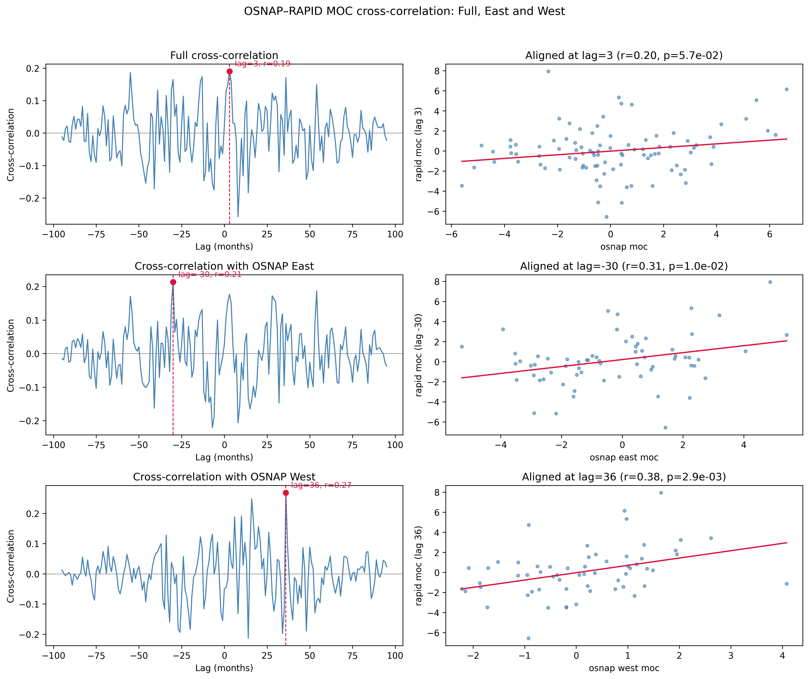

*Figure 11: Cross-correlation between RAPID and individual OSNAP components*

- **OSNAP full vs RAPID:** lag = +3 months, r ≈ 0.19–0.20, p = 0.057 (consistent with the deseasonalised + detrended result above).
- **OSNAP East vs RAPID:** lag = −30 months, r ≈ 0.21–0.31, p = 0.01.
- **OSNAP West vs RAPID:** lag = +36 months, r ≈ 0.27–0.38, p = 0.0029.

The East and West components correlate more strongly with RAPID than the full OSNAP MOC does, but only at multi-year lags. To check whether this is physically plausible or simply a sample-size artefact, the table below gives the integral timescale and EDOF for all four series at the same processing stage (deseasonalised and detrended):

| Series | Integral timescale (months) | EDOF (N_eff) |
|---|---|---|
| RAPID MOC | 0.27 | 88.52 |
| OSNAP MOC (full) | 0.46 | 51.98 |
| OSNAP East | 0.61 | 39.65 |
| OSNAP West | 0.71 | 34.02 |

OSNAP West is the most persistent of the four series (longest integral timescale) and therefore the one with the fewest effective samples. Also it is the one showing the strongest correlation, at the longest lag of 36 months. A 2.5–3 year lag is long relative to the roughly 8-year OSNAP record, so implying genuine information propagation might be a little optimistic. However, the combination of high persistence and low EDOF in OSNAP West means a low-frequency alignment could be a plausible explanation. This result should be treated as suggestive rather than conclusive.

# Conclusion

- T_int (the geostrophic component) reproduces most of the amplitude and variability of UMO, but is offset in its mean and over-amplified relative to it.
- Both RAPID MOC and UMO show a naively "highly significant" declining trend of roughly −0.10 Sv/yr. Once autocorrelation is accounted for via the effective degrees of freedom, this trend becomes non-significant (MOC) or marginal (UMO). This is a clear example of why the raw sample size should never be trusted alone, for calculating whether a trend is significant.
- OSNAP and RAPID MOC show weak-to-moderate cross-correlation (r ≈ 0.2–0.3) at short lags of a few months. This relationship survives detrending alone but weakens once both the seasonal cycle and the trend are removed, hinting to shared low-frequency variability rather than an established, robust link.
- Splitting OSNAP into its East and West components reveals stronger correlations with RAPID, but at multi-year lags. OSNAP West, which shows the strongest correlation (r ≈ 0.27–0.38) at the longest lag (36 months), also has the lowest EDOF of any series considered (N_eff ≈ 34, against 96 monthly points). In respect to the effective sample size, this results in interpreting this more as a suggestive link rater than a conclusive relationship, although higher correlation and lower p-value implies more confidence into the link than when comparing the full OSNAP MOC to RAPID.
- As the west and east contribute differently to the full OSNAP MOC, where most of the amplitude and variability is explained by the east, it was not surprising that the lag differed. However, a difference in correlation and that one is more correlated with the RAPID MOC than the other, was surprising. As both timeseries are continuously updated, redoing this analysis, with a greater effective sample size might reveal if this weak relationship was incidental or real. 
- Across all analyses, distinguishing correlation strength (r) from statistical significance is essential. Naive p-values based on the raw sample size highly overstate confidence for autocorrelated timeseries, and the effective sample size should always be reported alongside r.

# Sources
- Emery & Thomson, *Data Analysis Methods in Physical Oceanography*, Ch. 5 (§5.6 Spectral analysis; §5.10 Digital filters)
- AMOCatlas: https://github.com/AMOCcommunity/AMOCatlas
- Lecture deck and starter code (`correlation_trends`, `amoc_analysis`)
- G.D. McCarthy, D.A. Smeed, W.E. Johns, E. Frajka-Williams, B.I. Moat, D. Rayner, M.O. Baringer, C.S. Meinen, J. Collins, H.L. Bryden, Measuring the Atlantic Meridional Overturning Circulation at 26°N, *Progress in Oceanography*, Volume 130, 2015, Pages 91-111, ISSN 0079-6611, https://doi.org/10.1016/j.pocean.2014.10.006.
